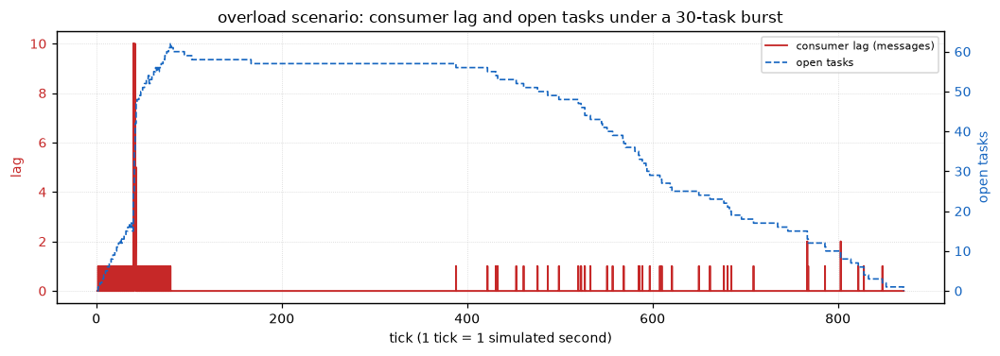
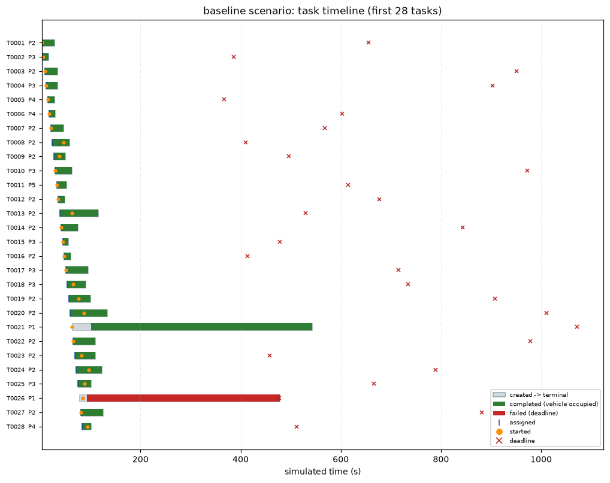
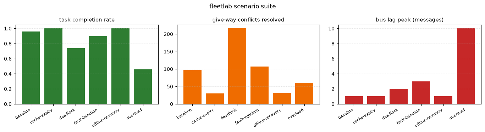
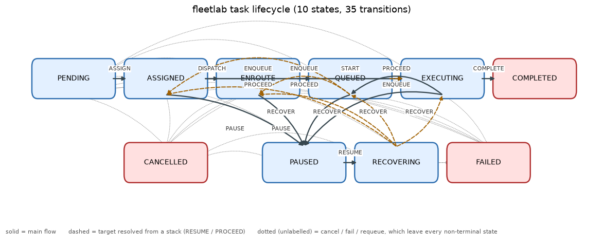
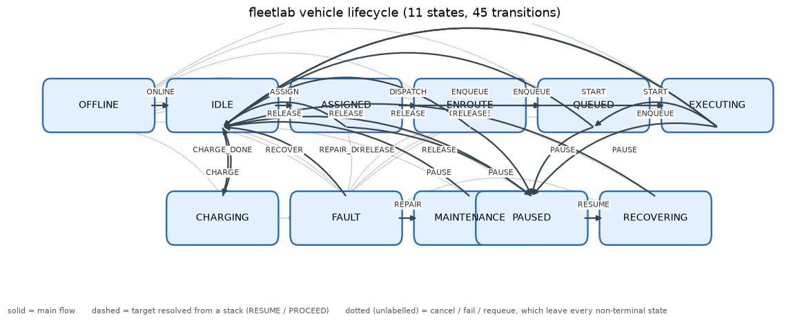

# fleetlab 实验报告（仿真）

> **本报告的全部数据由程序从固定种子的伪随机数发生器生成，是六枢纽仿真场地上的
> 合成数据，不是任何真实港口、码头或车队的运营数据。**
> 运行过程没有连接任何真实的 Redis / Kafka / RabbitMQ / MQTT 服务：
> 消息总线与状态缓存都是本项目自实现的，Redis 适配层用 fakeredis 验证命令语义。

- 场景套件运行耗时（墙钟）：**1.65 s**（唯一不参与两次运行一致性比对的值）
- Python：3.12.10

## 1. 场景总览

| 场景 | tick | 任务完成 | 完成率 | 抢占 | 让行冲突 | 积压峰值 | 一致性 |
|---|---:|---:|---:|---:|---:|---:|:--:|
| `baseline` | 690 | 48/50 | 0.960 | 10 | 97 | 1.0 | ✅ |
| `overload` | 871 | 32/70 | 0.457 | 10 | 61 | 10.0 | ✅ |
| `fault-injection` | 600 | 45/50 | 0.900 | 13 | 107 | 3.0 | ✅ |
| `deadlock` | 952 | 37/50 | 0.740 | 10 | 216 | 2.0 | ✅ |
| `cache-expiry` | 251 | 50/50 | 1.000 | 0 | 30 | 1.0 | ✅ |
| `offline-recovery` | 248 | 50/50 | 1.000 | 0 | 31 | 1.0 | ✅ |

## 2. 关键结果（全部来自本次真实运行）

| 指标 | 数值 |
|---|---:|
| `all_scenarios_consistent` | True |
| `baseline_completed` | 48 |
| `baseline_completion_rate` | 0.96 |
| `baseline_cycle_p95_ms` | 535000 |
| `baseline_dispatch_mean_ms` | 17760.0 |
| `baseline_dispatch_p50_ms` | 0 |
| `baseline_dispatch_p95_ms` | 59000 |
| `baseline_tasks` | 50 |
| `bus_backpressure_rejections` | 37 |
| `bus_deferred_publishes` | 37 |
| `bus_lag_peak` | 10.0 |
| `bus_published_total` | 2635 |
| `cache_consistent` | True |
| `cache_expiries` | 59 |
| `cache_expiry_events` | 3 |
| `cache_keys_lost` | 59 |
| `command_duplicates` | 9 |
| `command_idempotent` | True |
| `command_pause_effects` | 1 |
| `command_pause_records` | 1 |
| `deadlock_scenario_breaks` | 4 |
| `deadlock_scenario_completion_rate` | 0.74 |
| `deadlock_scenario_conflicts` | 216 |
| `dlq_depth_peak` | 3 |
| `dlq_recovered` | True |
| `dlq_redrives_total` | 9 |
| `dlq_routed_total` | 9 |
| `duplicates_suppressed` | 110 |
| `fault_scenario_checks` | injected_faults_absorbed=True, no_duplicate_effect=True, no_task_lost=True, replay_matches_live=True |
| `fault_scenario_consistent` | True |
| `fault_scenario_crashes` | 1 |
| `fault_scenario_drops` | 88 |
| `fault_scenario_duplicates` | 155 |
| `fault_scenario_poisons` | 4 |
| `fault_scenario_reordered` | 228 |
| `fault_scenario_timeouts` | 8 |
| `gap_recoveries` | 47 |
| `offline_alerts` | 3 |
| `offline_consistent` | True |
| `offline_events` | 3 |
| `offline_reconnects` | 3 |
| `out_of_order_detected` | 50 |
| `overload_completed` | 32 |
| `overload_completion_rate` | 0.4571 |
| `overload_conflicts` | 61 |
| `overload_dispatch_p95_ms` | 739000 |
| `overload_tasks` | 70 |
| `overload_wait_timeouts` | 25 |

## 3. 各场景详情

### 3.1 `baseline`

- 停止原因：all tasks terminal
- 任务：创建 50，完成 48，失败 2，取消 0，完成率 0.96
- 调度延迟 ms：mean=17760.0 p50=0 p95=59000 max=403000
- 状态机：转移 447 次，非法转移被拒 0 次
- 总线：发布 497，背压拒绝 0，积压峰值 1.0，死信 0
- 消费端：处理 497，去重抑制 0，乱序检出 0，gap 回读 0，nack 0
- 故障注入命中：cache_expiries=0, crashes=0, drops=0, duplicates=0, poisons=0, reordered_batches=0, reordered_messages=0, retries_forced=0, timeouts=0
- 恢复动作：cache_expiries=0, consumer_crashes=0, deadline_failures=2, deadlock_breaks=0, dlq_redrives=0, wait_timeouts=58
- 告警：task_timeout=25；链路追踪：evicted_traces=0, spans=994, traces=944

**一致性判定**（判据：replay(lifecycle_fingerprint) == live(lifecycle_fingerprint) AND every created task terminal exactly once AND every injected fault absorbed）

| 检查项 | 结果 |
|---|:--:|
| `injected_faults_absorbed` | ✅ |
| `no_duplicate_effect` | ✅ |
| `no_task_lost` | ✅ |
| `replay_matches_live` | ✅ |

- 生命周​期指纹 live=`a75cf7fa2f331f28a489a30d8b1bdb45` replay=`a75cf7fa2f331f28a489a30d8b1bdb45`
- 事件日志：501 条，digest=`a9cd67f81fb3d3bef6f6a3edcbfb8715`

### 3.2 `overload`

- 停止原因：all tasks terminal
- 任务：创建 70，完成 32，失败 38，取消 0，完成率 0.4571
- 调度延迟 ms：mean=331836.735 p50=503000 p95=739000 max=750000
- 状态机：转移 350 次，非法转移被拒 2 次
- 总线：发布 423，背压拒绝 37，积压峰值 10.0，死信 0
- 消费端：处理 423，去重抑制 0，乱序检出 0，gap 回读 0，nack 0
- 故障注入命中：cache_expiries=0, crashes=0, drops=0, duplicates=0, poisons=0, reordered_batches=0, reordered_messages=0, retries_forced=0, timeouts=0
- 恢复动作：cache_expiries=0, consumer_crashes=0, deadline_failures=38, deadlock_breaks=0, dlq_redrives=0, wait_timeouts=25
- 告警：task_timeout=123；链路追踪：evicted_traces=0, spans=883, traces=776

**一致性判定**（判据：replay(lifecycle_fingerprint) == live(lifecycle_fingerprint) AND every created task terminal exactly once AND every injected fault absorbed）

| 检查项 | 结果 |
|---|:--:|
| `injected_faults_absorbed` | ✅ |
| `no_duplicate_effect` | ✅ |
| `no_task_lost` | ✅ |
| `replay_matches_live` | ✅ |

- 生命周​期指纹 live=`c9f4805bcb2bd745d62605569d889d80` replay=`c9f4805bcb2bd745d62605569d889d80`
- 事件日志：435 条，digest=`8c1176d1d7381cbd84f6f4b9c08cb5b7`

### 3.3 `fault-injection`

- 停止原因：all tasks terminal
- 任务：创建 50，完成 45，失败 5，取消 0，完成率 0.9
- 调度延迟 ms：mean=99980.0 p50=0 p95=364000 max=426000
- 状态机：转移 453 次，非法转移被拒 0 次
- 总线：发布 521，背压拒绝 0，积压峰值 3.0，死信 9
- 消费端：处理 515，去重抑制 110，乱序检出 50，gap 回读 47，nack 12
- 故障注入命中：cache_expiries=0, crashes=1, drops=88, duplicates=155, poisons=4, reordered_batches=205, reordered_messages=228, retries_forced=8, timeouts=8
- 恢复动作：cache_expiries=0, consumer_crashes=1, deadline_failures=5, deadlock_breaks=4, dlq_redrives=9, wait_timeouts=44
- 告警：dead_letter_depth=1, task_timeout=29；链路追踪：evicted_traces=0, spans=1027, traces=956

**一致性判定**（判据：replay(lifecycle_fingerprint) == live(lifecycle_fingerprint) AND every created task terminal exactly once AND every injected fault absorbed）

| 检查项 | 结果 |
|---|:--:|
| `injected_faults_absorbed` | ✅ |
| `no_duplicate_effect` | ✅ |
| `no_task_lost` | ✅ |
| `replay_matches_live` | ✅ |

- 生命周​期指纹 live=`4246162418e2c3f532e9053ff21c39ef` replay=`4246162418e2c3f532e9053ff21c39ef`
- 事件日志：505 条，digest=`f4d3504b898238278eeab7e97aeedf0e`
- 故障吸收：duplicates=155 suppressed=110; drops=88 gap_recoveries=47; reordered=228 order_checks=50; crashes=1 recoveries=1; timeouts=8 nacked=12; poisons=4 dlq_routed=9 redrives=9

### 3.4 `deadlock`

- 停止原因：all tasks terminal
- 任务：创建 50，完成 37，失败 13，取消 0，完成率 0.74
- 调度延迟 ms：mean=104122.449 p50=10000 p95=494000 max=508000
- 状态机：转移 522 次，非法转移被拒 0 次
- 总线：发布 572，背压拒绝 0，积压峰值 2.0，死信 0
- 消费端：处理 572，去重抑制 0，乱序检出 0，gap 回读 0，nack 0
- 故障注入命中：cache_expiries=0, crashes=0, drops=0, duplicates=0, poisons=0, reordered_batches=0, reordered_messages=0, retries_forced=0, timeouts=0
- 恢复动作：cache_expiries=0, consumer_crashes=0, deadline_failures=13, deadlock_breaks=4, dlq_redrives=0, wait_timeouts=62
- 告警：task_timeout=51；链路追踪：evicted_traces=0, spans=1144, traces=1094

**一致性判定**（判据：replay(lifecycle_fingerprint) == live(lifecycle_fingerprint) AND every created task terminal exactly once AND every injected fault absorbed）

| 检查项 | 结果 |
|---|:--:|
| `injected_faults_absorbed` | ✅ |
| `no_duplicate_effect` | ✅ |
| `no_task_lost` | ✅ |
| `replay_matches_live` | ✅ |

- 生命周​期指纹 live=`25d12250126fc621a8f25bbc60f5ccd7` replay=`25d12250126fc621a8f25bbc60f5ccd7`
- 事件日志：578 条，digest=`a4778c007fa54181f5c2f8e4f9144830`

### 3.5 `cache-expiry`

- 停止原因：all tasks terminal
- 任务：创建 50，完成 50，失败 0，取消 0，完成率 1.0
- 调度延迟 ms：mean=0.0 p50=0 p95=0 max=0
- 状态机：转移 260 次，非法转移被拒 0 次
- 总线：发布 310，背压拒绝 0，积压峰值 1.0，死信 0
- 消费端：处理 310，去重抑制 0，乱序检出 0，gap 回读 0，nack 0
- 故障注入命中：cache_expiries=59, crashes=0, drops=0, duplicates=0, poisons=0, reordered_batches=0, reordered_messages=0, retries_forced=0, timeouts=0
- 恢复动作：cache_expiries=59, consumer_crashes=0, deadline_failures=0, deadlock_breaks=0, dlq_redrives=0, wait_timeouts=0
- 告警：无；链路追踪：evicted_traces=0, spans=620, traces=570

**一致性判定**（判据：replay(lifecycle_fingerprint) == live(lifecycle_fingerprint) AND every created task terminal exactly once AND every injected fault absorbed）

| 检查项 | 结果 |
|---|:--:|
| `injected_faults_absorbed` | ✅ |
| `no_duplicate_effect` | ✅ |
| `no_task_lost` | ✅ |
| `replay_matches_live` | ✅ |

- 生命周​期指纹 live=`809f2e564a991cead2886fc1c87ed341` replay=`809f2e564a991cead2886fc1c87ed341`
- 事件日志：310 条，digest=`05d642053d913f9f2ff7712e3cc31b0f`

### 3.6 `offline-recovery`

- 停止原因：all tasks terminal
- 任务：创建 50，完成 50，失败 0，取消 0，完成率 1.0
- 调度延迟 ms：mean=0.0 p50=0 p95=0 max=0
- 状态机：转移 262 次，非法转移被拒 0 次
- 总线：发布 312，背压拒绝 0，积压峰值 1.0，死信 0
- 消费端：处理 312，去重抑制 0，乱序检出 0，gap 回读 0，nack 0
- 故障注入命中：cache_expiries=0, crashes=0, drops=0, duplicates=0, poisons=0, reordered_batches=0, reordered_messages=0, retries_forced=0, timeouts=0
- 恢复动作：cache_expiries=0, consumer_crashes=0, deadline_failures=0, deadlock_breaks=0, dlq_redrives=0, wait_timeouts=0
- 告警：vehicle_offline=3；链路追踪：evicted_traces=0, spans=624, traces=574

**一致性判定**（判据：replay(lifecycle_fingerprint) == live(lifecycle_fingerprint) AND every created task terminal exactly once AND every injected fault absorbed）

| 检查项 | 结果 |
|---|:--:|
| `injected_faults_absorbed` | ✅ |
| `no_duplicate_effect` | ✅ |
| `no_task_lost` | ✅ |
| `replay_matches_live` | ✅ |

- 生命周​期指纹 live=`67fd66ce47ef5f11e946aa4eb7cfffad` replay=`67fd66ce47ef5f11e946aa4eb7cfffad`
- 事件日志：318 条，digest=`bc151dbf2f42b260c333253f134e7c6e`

## 4. 幂等实验

### 4.1 控制指令幂等（同一指令连发 10 次）

- 起始状态：`ENROUTE`
- PAUSE 发送 10 次：applied=1，duplicate=9
- 车辆 `pause_commands` 计数变化：1
- 事件日志中的 PAUSE 记录数：1
- RESUME 发送 10 次：applied=1，duplicate=9
- 车辆 `resume_commands` 计数变化：1
- 结论：**幂等成立**

### 4.2 死信队列与重投

- 注入毒消息：3 条
- 首轮后死信深度：3
- 记录的重试次数：3 条消息，最大重试 4
- 重投条数：3，重投后死信深度：0
- 恢复的任务数：0 → 3
- 结论：**死信可恢复**

## 5. 图表

### overload 场景消费积压与未完成任务

### baseline 场景任务甘特图

### 场景套件对比

### 任务生命周期状态机（10 状态 / 34 迁移）

### 车辆状态机（11 状态）

## 6. 一致性判据说明

每条场景结束后执行四项独立检查：

1. **`replay_matches_live`** — 把事件日志按序重放进一个全新的状态对象，
   比较 `PlatformState.lifecycle_fingerprint()`（任务状态/指派/车辆状态的规范投影的 SHA-256）。
2. **`no_task_lost`** — 每个 `task_created` 事件对应的任务都存在，且全部到达终态。
3. **`no_duplicate_effect`** — 没有任何任务到达终态两次，也没有任何任务被完成两次。
4. **`injected_faults_absorbed`** — 注入器实际触发的每一种故障都有对应的吸收计数：
   重复→去重抑制，丢失→gap 回读，乱序→乱序检出，崩溃→从提交位点恢复，
   超时→nack 重试，毒消息→死信 + 重投。

四项全为真才判定该场景「最终一致」。

